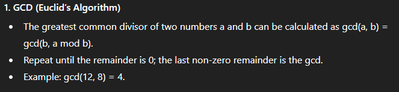
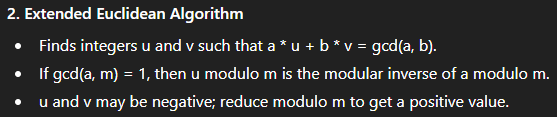
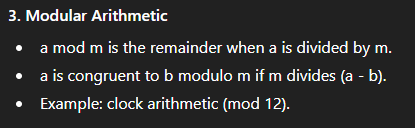
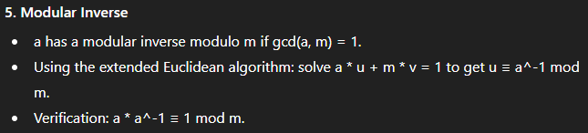

# Summary

This writeup documents the full solutions to **Modular Arithmetics** course on CryptoHack with a .py file for some exercices

**Goal:** Solve a series of mathematical problems

---

# Problem Statement

> The problems are a sequence of small exercises designed to teach and test basic modular arithmetic and the (extended) Euclidean algorithm.


---

# Tools & Environment

- **Language:** Python 3.9+  
- **Libraries:** Libraries: None required for the core math (built-in pow and % suffice). Optionally gmpy2 or sympy for very large involved tasks.
- **CLI utilities:** none necessary 
- **Optional:** SageMath for symbolic math

Run environment example:
```bash
python --version   # Python 3.9+
pip install pycryptodome gmpy2 sympy
```

---

# Theory



---



---



---


**Therefore the result is`` 1 ``**

---



**Therefore the result is`` 9 ``**

## 6. 