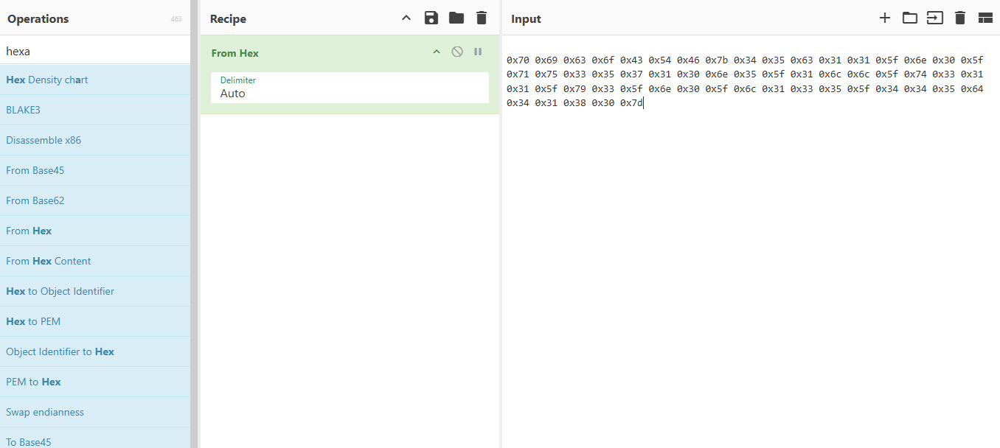

# 🚀 General Skills ASCII Numbers picoCTF  
**Source:** picoCTF  
**Category:** General Skills  
**Difficulty:** Medium  
**Goal:** Find the hidden flag encoded with ASCII

---

## 🔎 Description / Context

This challenge tests your ability to decode strings of ASCII

---

## 🎯 Objective

Convert the following string of ASCII numbers into a readable string:
0x70 0x69 0x63 0x6f 0x43 0x54 0x46 0x7b 0x34 0x35 0x63 0x31 0x31 0x5f 0x6e 0x30 0x5f 0x71 0x75 0x33 0x35 0x37 0x31 0x30 0x6e 0x35 0x5f 0x31 0x6c 0x6c 0x5f 0x74 0x33 0x31 0x31 0x5f 0x79 0x33 0x5f 0x6e 0x30 0x5f 0x6c 0x31 0x33 0x35 0x5f 0x34 0x34 0x35 0x64 0x34 0x31 0x38 0x30 0x7d

---

## ⚙️ Prerequisites

- Basic knowledge of:
  - ASCII
  - CyberChef

---

## ▶️ Quick Steps / Approach

1. Open the challenge page.  
2. Open the CyberChef page.
3. Cook the Flag.

---

## 🧭 Solution (SPOILER)

 Solution 

1. Open the picoCTF challenge ASCII Numbers.   
2. Open the CyberChef page 
3. Put ``From Hex`` in the recipe and the ASCII as input 

4. You will have the flag as the output 

## ❌ Common Mistakes

- Not Recognizing the Format
- Tool Misuse

## ✅ What I Learned

- ASCII Encoding Knowledge
- Hexadecimal Representation

## 🔗 Useful Links

- picoCTF Web Exploitation: https://play.picoctf.org/practice
- CyberChef : https://gchq.github.io/CyberChef/#ieol=CRLF&oeol=CRLF 
