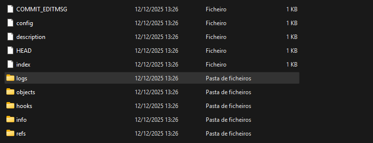

# 🚀 General Skills Blame Game picoCTF  
**Source:** picoCTF  
**Category:** General Skills  
**Difficulty:** Easy  
**Goal:** Find the hidden flag inside the logs  

---

## 🔎 Description / Context

Someone's commits seems to be preventing the program from working. Who is it?

---

## 🎯 Objective

Locate the **flag** hidden somewhere inside the commits.

---

## ⚙️ Prerequisites

- Basic knowledge of:
  - logs
  - Git

---

## ▶️ Quick Steps / Approach

1. Open the challenge page.  
2. Bypass the login
3. Search the flag in the data base.

---

## 🧭 Solution (SPOILER)

 Solution 

1. Open the picoCTF challenge Blame Game.   
2. Download the challenge and open the logs in the git with a Text editor 

3. You will see the flag 

## ❌ Common Mistakes

- Assuming the latest commit is the bad one, the bug could be older.
- Not using git bisect, manual checking is slow for many commits.
- Forgetting to checkout back to main after checking commits.

## ✅ What I Learned

- How to use git bisect to find bug-introducing commits.
- The importance of commit messages and clean Git history.
- Basic forensic analysis in version control systems.

## 🔗 Useful Links

- picoCTF Web Exploitation: https://play.picoctf.org/practice
