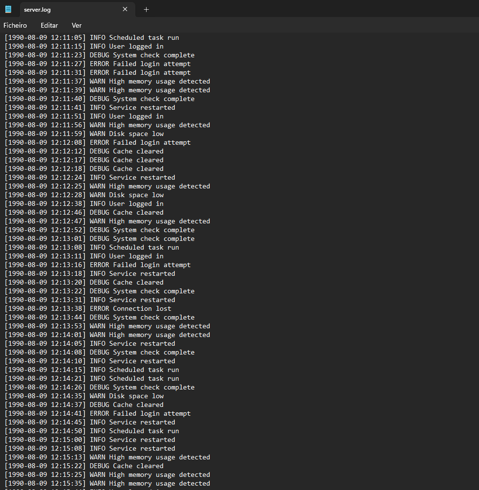
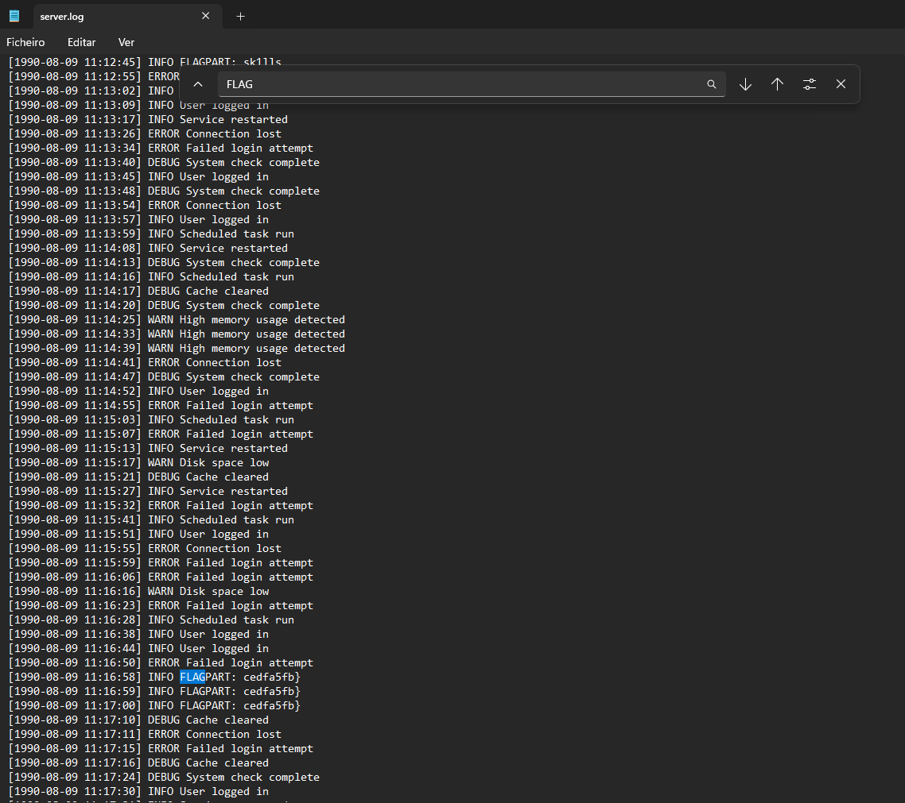

# 🚀 Web Exploitation Log Hunt picoCTF  
**Source:** picoCTF  
**Category:** General Skills  
**Difficulty:** Easy  
**Goal:** Find the hidden flag inside the code

---

## 🔎 Description / Context

Our server seems to be leaking pieces of a secret flag in its logs. The parts are scattered and sometimes repeated. Can you reconstruct the original flag?

---

## 🎯 Objective

Locate the **flag** hidden somewhere inside the logs.

---

## ⚙️ Prerequisites

- Text editor or command-line tools (e.g., grep, cat, less)
- Basic understanding of log file formats

---

## ▶️ Quick Steps / Approach

1. Download the provided server.log file.
2. Search for lines containing FLAGPART.
3. Extract unique flag fragments.
4. Arrange fragments in the correct order to form the complete flag.

---

## 🧭 Solution (SPOILER)

 Solution 

1. Open the picoCTF challenge Log Hunt.  
2. Download the logs and open it with a Text editor 

3. Search for the flag 

4. Arrange the fragments in order to have the complete flag 

## ❌ Common Mistakes

- Overlooking duplicates: The same fragment appears many times
- Incorrect ordering: The flag follows a readable phrase structure, not chronological order in logs.
- Missing curly braces: Ensure the flag includes both opening { and closing }.

## ✅ What I Learned

- How to parse and extract information from large log files.
- The importance of pattern recognition in forensic challenges.
- Using command-line tools (grep, sort, uniq) for quick data analysis.

## 🔗 Useful Links

- picoCTF Web Exploitation: https://play.picoctf.org/practice
- linux manual: https://www.gnu.org/software/grep/manual/grep.html 
