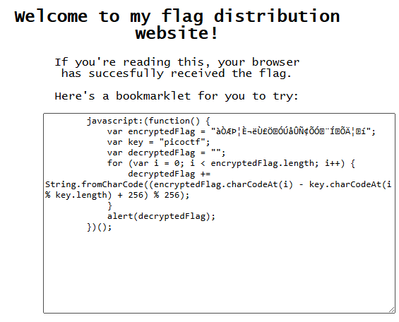

# 🚀 Web Exploitation Bookmarklet picoCTF  
**Source:** picoCTF  
**Category:** Web Exploitation  
**Difficulty:** easy  
**Goal:** Find the hidden flag inside the code

---

## 🔎 Description / Context

Why search for the flag when I can make a bookmarklet to print it for me?
Browse here, and find the flag!

---

## 🎯 Objective

Locate the **flag** hidden somewhere inside the webpage.

---

## ⚙️ Prerequisites

- Modern web browser (Chrome, Firefox, Edge)
- Basic knowledge of:
  - Javascript
- Understanding of cryptography

---

## ▶️ Quick Steps / Approach

1. Open the challenge page.  
2. Look at the script
3. Run it

---

## 🧭 Solution (SPOILER)

 Solution 

1. Open the picoCTF challenge Bookmarklet.  
2. Look at the javascript code  
  
3. You will see ``encryptedFlag`` it contains the encrypted bytes stored as characters.
4. ``key = "picoctf"`` its the encryption key. It repeats over the whole string (like Vigenère).

5. ``decryptedFlag = ""`` Empty string where the plaintext will be built.

6. The ``for`` loop: 

- ``encryptedFlag.charCodeAt(i)`` gets the byte value of the encrypted character. 

- ``key.charCodeAt(i % key.length)`` gets the current key byte (repeating the key). 

- ``(cipher_byte - key_byte + 256) % 256`` this reverses the encryption and keeps the result between 0–255. 

- ``String.fromCharCode(...)`` converts it back into a character. 

- Append to ``decryptedFlag`` 

- ``alert(decryptedFlag)`` shows the decrypted message. 

7. This type of encription is very bad because its a very simple encryption/decryption method and you have the code to decrypt 

8. We have succeeded to find the flag!

## ❌ Common Mistakes

- Assuming encryption is always “+”
- Not checking output formatting

## ✅ What I Learned

- How simple the Vigenere encription is
- How repeating-key ciphers work

## 🔗 Useful Links

- picoCTF Web Exploitation: https://play.picoctf.org/practice
