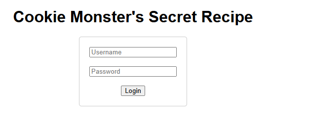

# 🚀 Web Exploitation Cookie Monster Secret Recipe picoCTF  
**Source:** picoCTF  
**Category:** Web Exploitation  
**Difficulty:** easy  
**Goal:** Find the hidden flag inside the code

---

## 🔎 Description / Context

This challenge tests your ability to find cookies and decode them

---

## 🎯 Objective

Locate the **flag** hidden somewhere inside the webpage.

---

## ⚙️ Prerequisites

- Modern web browser (Chrome, Firefox, Edge)
- Basic knowledge of:
  - cookies
  - Developer Tools

---

## ▶️ Quick Steps / Approach

1. Open the challenge page.  
2. Open the Developer Tools
3. Search for the cookie

---

## 🧭 Solution (SPOILER)

 Solution 

1. Open the picoCTF challenge Cookie Monster Secret Recipe  
2. Try usernamer: admin ; password: password It will not work 
 
3. Search for the Cookies on this website, there will be a String
4. This String is encoded
5. The flag was successfully retrieved.

## ❌ Common Mistakes

- Not searching for cookies
- Using weak encoding

## ✅ What I Learned

- Encryption vs encoding
- Recognizing Base64

## 🔗 Useful Links

- picoCTF Web Exploitation: https://play.picoctf.org/practice
