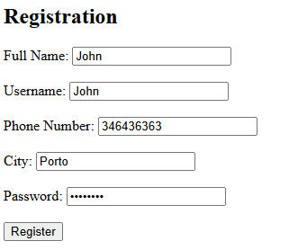
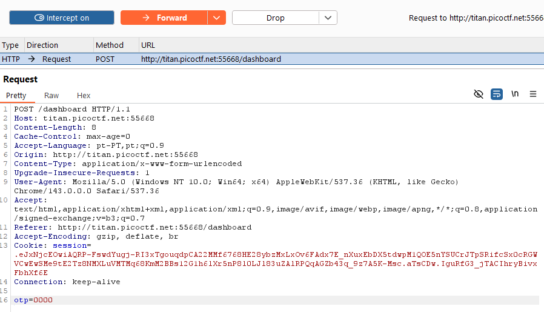

# 🚀 Web Exploitation IntroToBurp picoCTF  
**Source:** picoCTF  
**Category:** Web Exploitation  
**Difficulty:** Easy  
**Goal:** Find the hidden flag inside the code

---

## 🔎 Description / Context

This challenge tests your ability to intercept request to capture the flag.

---

## 🎯 Objective

Locate the **flag** hidden somewhere inside the webpage.

---

## ⚙️ Prerequisites

- Modern web browser (Chrome, Firefox, Edge)
- Basic knowledge of:
  - HTTPS
  - Burpsuite

---

## ▶️ Quick Steps / Approach

1. Open the challenge page.  
2. Open BurpSuite
3. Intercept requests.

---

## 🧭 Solution (SPOILER)

 Solution 

1. Open the picoCTF challenge IntroToBurp.   
2. You have to put something on all the inputs of the registration page 
 
3. Click Register 
4. Application will ask for OTP in the next page 
 
5. Provide any random value as OTP and click on the Submit which will show a message as “Invalid OTP”. 
6. Open the BurpSuite 
7. Use the Proxy and intercept the request 
 
8. Eliminate the line ``otp=0000`` 
9. Now forward the request 
10. Now you will see the flag 

## ❌ Common Mistakes

- Not intercepting requests

## ✅ What I Learned

- How to intercept requests using BurpSuite

## 🔗 Useful Links

- picoCTF Web Exploitation: https://play.picoctf.org/practice
