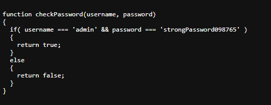

# 🚀 Web Exploitation Local Authority picoCTF  

**Source:** picoCTF  
**Category:** Web Exploitation  
**Difficulty:** Easy  
**Goal:** Find the hidden flag inside the code

---

## 🔎 Description / Context

This challenge tests your ability to recognize XSS

---

## 🎯 Objective

Locate the **flag** hidden somewhere inside the webpage.

---

## ⚙️ Prerequisites

- Modern web browser (Chrome, Firefox, Edge)
- Basic knowledge of:
  - Developer Tools
  - XSS

---

## ▶️ Quick Steps / Approach

1. Open the challenge page.  
2. Open the Developer Tools
3. Search the javascript file and execute it
4. Login

---

## 🧭 Solution (SPOILER)

 Solution 

1. Open the picoCTF challenge Local Authority.  
2. Try usernamer: admin ; password: password It will fail
3. Open the Developer tools 

4. You will see``secure.js`` 
5. In the URL we have``http://saturn.picoctf.net:54803/`` We have just to add ``secure.js`` 
6. We will have the username and password 

7. Now we have jsut to login 

## ❌ Common Mistakes

- Not sanitizing the input
- Not using a strong Content-Security-Policy

## ✅ What I Learned

- How XSS can be dangerous
- Its easy to ataque a website with XSS

## 🔗 Useful Links

- picoCTF Web Exploitation: <https://play.picoctf.org/practice>
