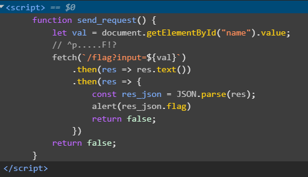

# 🚀 Web Exploitation MatchTheRegex picoCTF  
**Source:** picoCTF  
**Category:** Web Exploitation  
**Difficulty:** Medium  
**Goal:** Find the hidden flag inside the code

---

## 🔎 Description / Context

This challenge tests your ability to understand the logic of the Regex

---

## 🎯 Objective

Locate the **flag** hidden somewhere inside the webpage.

---

## ⚙️ Prerequisites

- Modern web browser (Chrome, Firefox, Edge)
- Basic knowledge of:
  - Regex
  - Developer Tools

---

## ▶️ Quick Steps / Approach

1. Open the challenge page.  
2. Open the Developer Tools
3. Search the javascript file

---

## 🧭 Solution (SPOILER)

 Solution 

1. Open the picoCTF challenge MatchTheRegex.   
2. Try input: hello world 
3. Open The developer tools 

3. You will see this javascript with a comment ``// ^p.....F!?`` 
4. Regex Rules:
- ``^  ``→ start of string  
- ``p `` → must begin with "p"  
- ``.....`` → any 5 characters  
- ``F`` → must have "F"  
- ``!?`` → optionally "!" then "?"  
5.The flag was successfully retrieved

## ❌ Common Mistakes

- Assuming all user input is safe
- Putting user input directly into a URL
- Not sanitizing or encoding values

## ✅ What I Learned

- How XSS, query injection, and filter bypass often start with very small mistakes
- How JSON parsing can fail or leak information depending on server responses.

## 🔗 Useful Links

- picoCTF Web Exploitation: https://play.picoctf.org/practice
