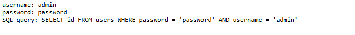
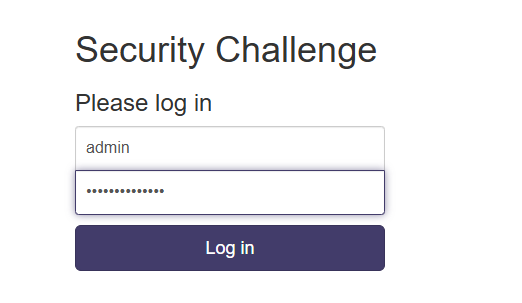
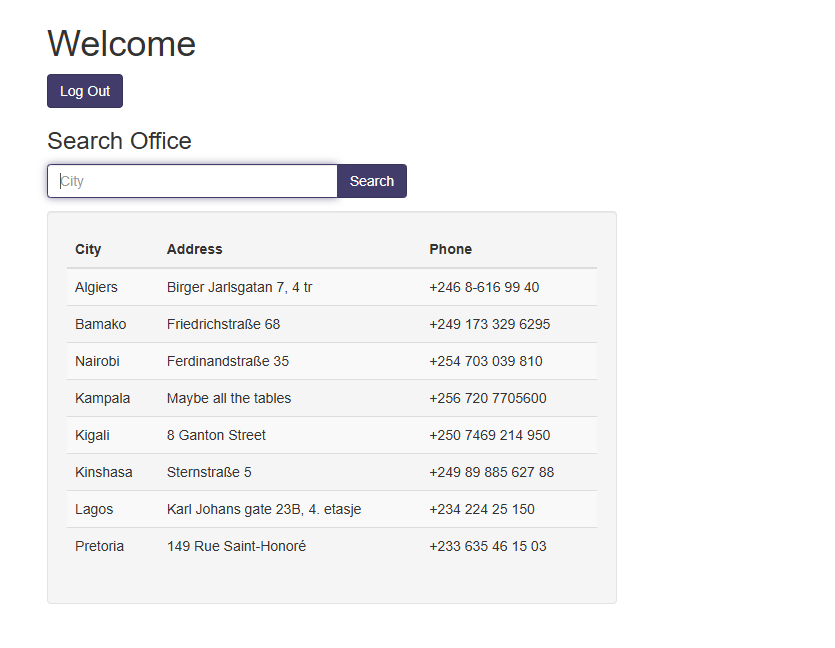

# 🚀 Web Exploitation More SQLi picoCTF  
**Source:** picoCTF  
**Category:** Web Exploitation  
**Difficulty:** Medium  
**Goal:** Find the hidden flag inside the code

---

## 🔎 Description / Context

This challenge tests your ability to bypass the login and enumerate the columns to reveal hidden information.

---

## 🎯 Objective

Locate the **flag** hidden somewhere inside the webpage.

---

## ⚙️ Prerequisites

- Modern web browser (Chrome, Firefox, Edge)
- Basic knowledge of:
  - SQL
- Understanding of login & search metods

---

## ▶️ Quick Steps / Approach

1. Open the challenge page.  
2. Bypass the login
3. Search the flag in the data base.

---

## 🧭 Solution (SPOILER)

 Solution 

1. Open the picoCTF challenge “More SQLi”.  
2. Try usernamer: admin ; password: password 

3. You will see``SQL query: SELECT id FROM users WHERE password = 'password' AND username = 'admin'``
4. We see how the input is managed
5. We can now bypass it 

6. it will bypass the login
7. Now we have to discover the flag in one of the columns by enumerating the tables  

8. Try this input:``' UNION SELECT 1,2,3--``
9. It will print 1 2 3
10. This confirms that it has 3 columns and the union worked as well
11. Now we explore this union injection
12. The flag was successfully retrieved.

## ❌ Common Mistakes

- Not checking SQLi
- Not sanitizing the input

## ✅ What I Learned

- How easy and powrful SQLi is.
- UNION-Based SQL Injection Enumeration

## 🔗 Useful Links

- picoCTF Web Exploitation: https://play.picoctf.org/practice
