# 📝 Pentesting Mercury Vulnhub

## 📌 General Information
- **Platform:** Vulnhub
- **Category/Series:** The Planets
- **Difficulty:** Easy
- **Author:**  SirFlash
- **Date release:** 4 Sep 2020

---

## ⚠️ Legal & Ethical Notice
This write‑up is for educational purposes only. Do **not** perform testing without explicit authorization.

---

## 🎯 Challenge Objective
> Mercury is an easier box, with no bruteforcing required. There are two flags on the box: a user and root flag which include an md5 hash.

---

## 🛠️ Environment Used
- Operating system: kali Linux
- Tools used: nmap sqlmap
- Network:   -DHCP service: Enabled  
          -IP address: Automatically assign  

---

## 🔍 Methodology (Overview)
- Reconnaissance 
- Scanning & Enumeration  
- Exploitation  
- Post-Exploitation (if applicable)

---

## 🔎 Reconnaissance
> If you dont know your ip go to the terminal and run: ip a
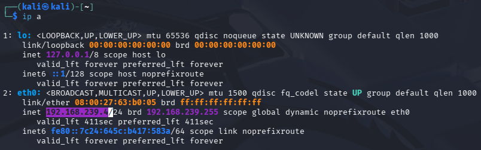

Now we run nmap to see whats in our network: nmap -sn 192.168.239.0/24
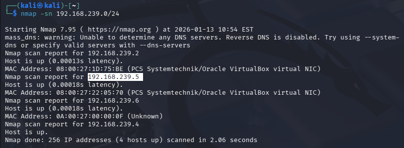

The ip of Mercury's virtual machine is ``192.168.239.5``
Now we scan the ip for open ports: ``nmap -sC -sV 192.168.239.5``
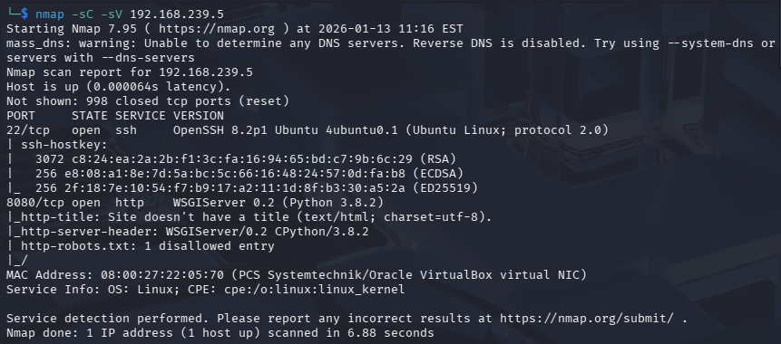
We can see that the port 8080 is open with the service http so there could be a website running and the port 22 for ssh
Now we can open a web browser and access the website: ``http://192.168.239.5:8080/``
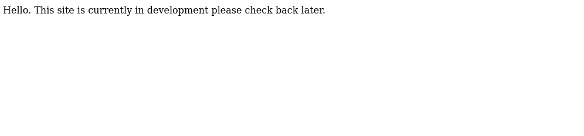
There could be hiden directories or files
We will use ffuf to find hiden directories or files:``ffuf -u "http://192.168.239.5:8080/FUZZ" -w /usr/share/wordlists/dirb/common.txt -t 50``
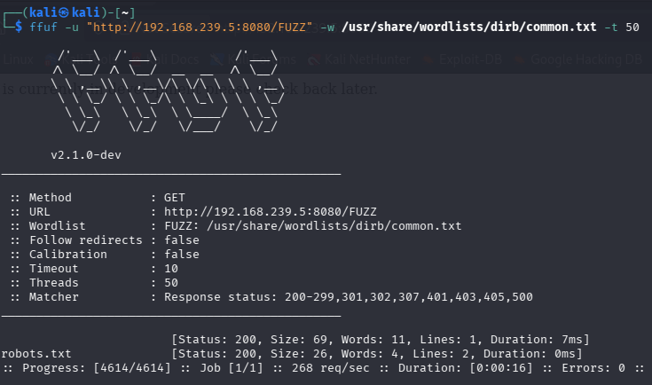
We found ``robots.txt``
Now we access the directory:``http://192.168.239.5:8080/robots.txt``
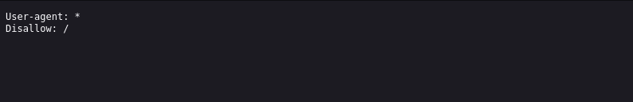
We can see that there is a error page if we substitue ``robots.txt`` with a ``*``

There we can see that there is a directory named:``mercuryfacts``
Now we access the directory:``http://192.168.239.5:8080/mercuryfacts``
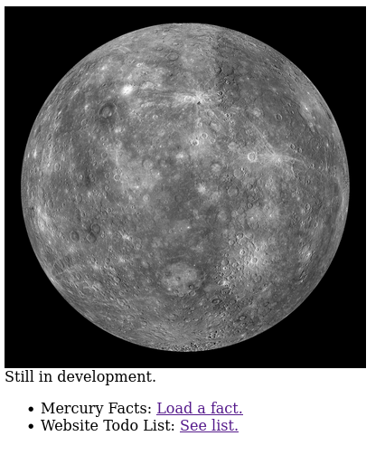

When we open the first link there is just a fact about Mercury with a id = 1
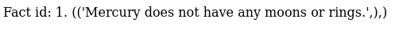
When we open the second link there is a todo list about the website giving us hints about the security of the website

We see that the website could be vulnerable to SQLi
To confirm this we go to the terminal and use sqlmap: ``sqlmap -u http://192.168.239.5:8080/mercuryfacts/``
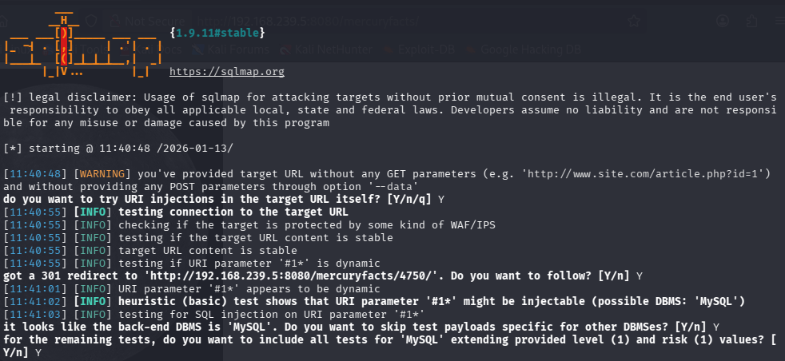
The website is vulnerable to SQLi with these three types:
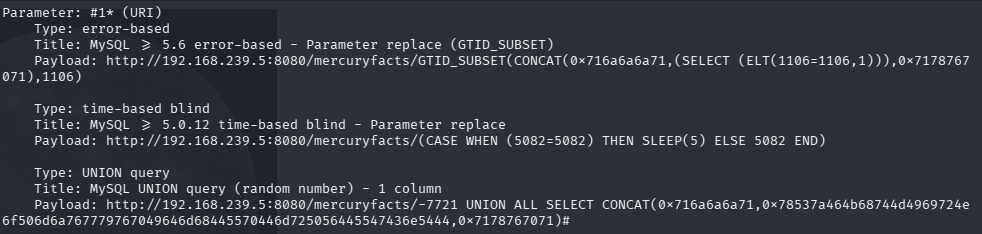

Now we want to know if we can gain access to the data base:``sqlmap -u http://192.168.239.5:8080/mercuryfacts/ --dbs --batch``
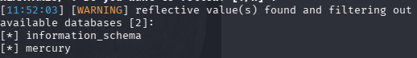
We discovored two data bases: ``information_schema``; ``mercury``

---

## 📚 Enumeration & Analysis
> Describe what was discovered (versions, pages, interesting functionality)

Key findings:
- 
- 
- 

---

## 🛡️ Identified Vulnerabilities (Technical Description)
- **Vulnerability name:**
- **Affected component:**
- **Brief description (no exploitation details):**
- **Potential impact:**

---

## 🧩 Flag Acquisition / Objectives
- Flag 1:
- Flag 2:
- Evidence (hashes, not sensitive data)

---

## ❌ Common Mistakes
- Suggested fixes
- Secure configurations
- Recommended monitoring

---

## ✅ What I Learned
- 
- 
- 

---

## 📎Useful Links
- Official documentation
- Security standards
- Relevant articles

